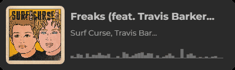

<h2>👥 How to reach me</h2>

 

---

<h2>💻 Languages</h2>

<code></code>
<code></code>
<code></code>
<code></code>
<code></code>
<code></code>
<code></code>

---

<h2>🛠️ Tools</h2>

<code></code>
<code></code>
<code></code>
<code></code>
<code></code>
<code></code>

---

- Work in progress

---
